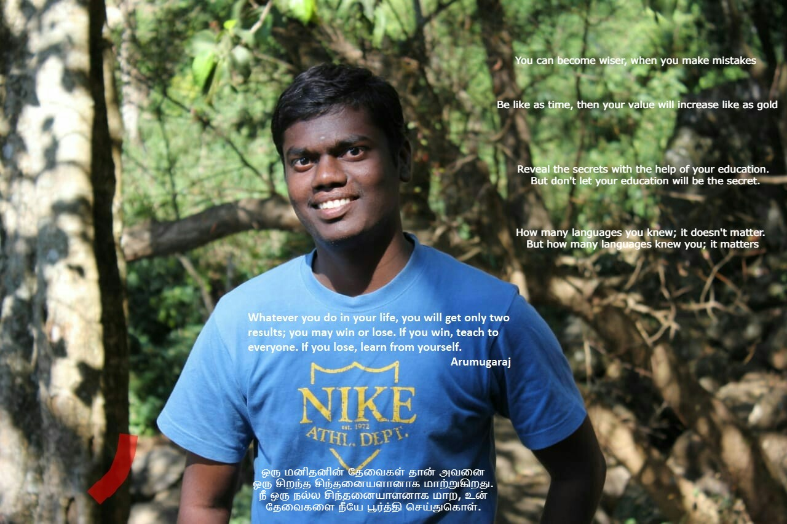
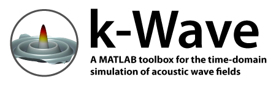
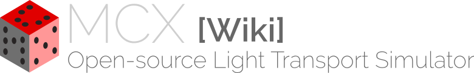
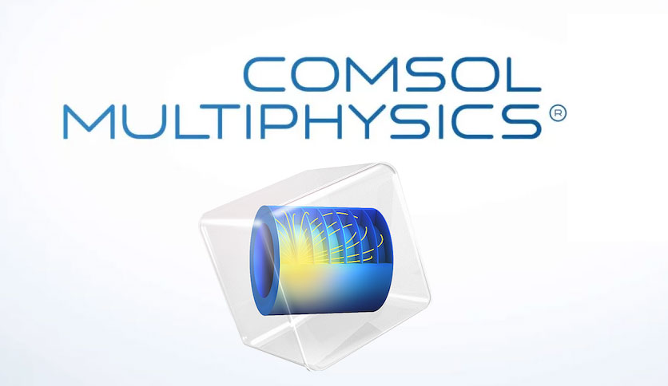
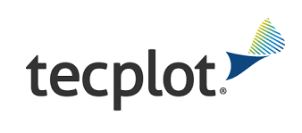

### வணக்கம், நான் ஆறுமுகராஜ் !   Hi there 👋 I am ARUMUGARAJ.M ! 

### About me:
- 🔭 Currently I’m working on Deep learning 
- 🌱 Currently I’m learning everything 🤣
- 👯 I’m looking to collaborate with other repository creators
- 🥅 2021 Goals: Contribute more to Open Source projects
- 🤔 I’m looking for help to learn more about deep learning programs
- 💬 Ask me about ...
- 📫 How to reach me: arumugraj.m@gmail.com
- ⚡ Fun fact about me: Sometimes, I don't know what I'm doing. Sometimes, I don't know what I have to do.

### Connect with me:
[][youtube]
[][facebook]
[][twitter]
[][li]
[][instagram]
[][git]
[][gmeet]

 

### Languages and Tools:

[][matlab]
[][kwave]
[][nirfast]
[][anaconda]
[][MCX]
[][comsol]

 

### Visualization Tools:
[][paraview]
[][tecplot]

### Education details:
- B.E (in Electrical and Electronics Engg. from Government College of Engineering, Bargur, TamilNadu - 2007-2011)
- M.Tech. (in Process Control and Instrumentation from NIT Trichy, TamilNadu - 2011-2013)

### Work experience:
- Temporary Faculty; Department of Electrical and Electronics Engineering, National Institute of Technology- Tiruchirappalli, Tamil Nadu, India; Aug 2018 – Dec 2019

### Subjects Taught:
#### Instructor for following subjects/ lab of B.Tech./M.Tech.:
- Subjects:Circuit Theory; Electric Power Utilization; Digital Signal Processing; Advanced Digital Signal Processing
- Laboratory handled:Power Systems Lab; DC Machines and transformer Lab; Synchronous and Induction Machines Lab; Integrated Circuits Laboratory;

### Awards and Grands:
- AICTE – GATE scholarship during M.Tech

### Achievements and Extra Curricular Activities:
- GATE: Qualified in 2011, 2013, 2015, 2018, 2019
- Hospitality core team member of ‘20th National Power System Conference (NPSC-2018)’ organized by National Institute of Technology- Tiruchirappalli, Tamil Nadu, India
- Hospitality core team member of ‘09th National Power Electronics Conference (NPEC-2019)’ organized by National Institute of Technology- Tiruchirappalli, Tamil Nadu, India
- A paper on A VEHICLE’S SIXTH SENSE was presented at Kumara guru College of Technology, Coimbatore.
- A paper on POWER QUALITY AND CONTROL was presented in ELECTRICUS’X-2010 at Infant Jesus College of Engineering, Tuticorin.
- Actively participated CIRCUIT DEBUGGING event in ELECTRICUS’X-2010 at Infant Jesus College of Engineering, Tuticorin.
- A paper on SMART SENSOR was presented in HESPEROS’10 at Government College of engineering, Bargur.
- Active member of N.S.S in GCE Bargur and participated in the SEVEN DAY special camping program at EMAKKALNATTHAM.
- Actively participated various games (Volley ball, Chess, 5000m Road Race) in intramural sports meet for the year of 2010-11 conducted by GCE, Bargur.
- Active member of software committee in National Level Technical Symposium PHANTASM'09 conducted by SEEE on 16th & 17th September 2009.
- அரசினர் பொறியியற் கல்லூரி பர்கூரில் நடைபெற்ற கலைச்சாரல்'11 விழாவில் பல்லூடகப் போட்டியில் பங்கு கொண்டுள்ளேன்.
- Delivered a talk at "The International Symposium on Instrumentation (ISI-03) & National Symposium on Instrumentation (NSI-43) 7th - 9th October 2021" in "Electro-Optics" track about optical fluece compensation using deep learning method.

### Research Interests:
#### IMAGING PHYSICS
1. Photoacoustic Tomography 
2. Computed Tomography
3. Magnetic Resonance Imaging

#### INVERSE PROBLEMS
1. Image Reconstruction
2. Deep Learning (Post processing)

#### IMAGE ANALYSIS
1. Image Restoration
2. Image Segmentation
3. Image Registration

### Contact Address:
Block A, 
Room number T022, 
C.V.Raman Road, IISc, 
Bengaluru, 
Karnataka (State), 
India (Country), 
Pin-560012. 
Email: arumugaraj.m@gmail.com, arumugarajm@iisc.ac.in  
Phone: +91 - 8838368879  

[youtube]: https://www.youtube.com/channel/UC3DtesIUQKZpZOtFJ5Ftdng
[facebook]: https://www.facebook.com/arumuga.raj.52
[kwave]: http://www.k-wave.org/
[nirfast]: https://milab.host.dartmouth.edu/nirfast/
[matlab]: https://www.mathworks.com/products/matlab.html
[anaconda]: https://www.anaconda.com/products/individual
[MCX]: http://mcx.space/wiki/index.cgi?Learn#mmc
[comsol]: https://www.comsol.co.in/product-download/5.4/windows
[twitter]: https://twitter.com/Arumuga76587827?s=08
[li]: https://www.linkedin.com/in/arumugaraj-m-95b92b38/
[instagram]: https://www.instagram.com/arumuga.raj.52/
[git]: https://github.com/arumugarajm
[gmeet]: https://meet.google.com/tya-vhbz-wcq
[tecplot]: https://www.tecplot.com/
[paraview]: https://www.paraview.org/

