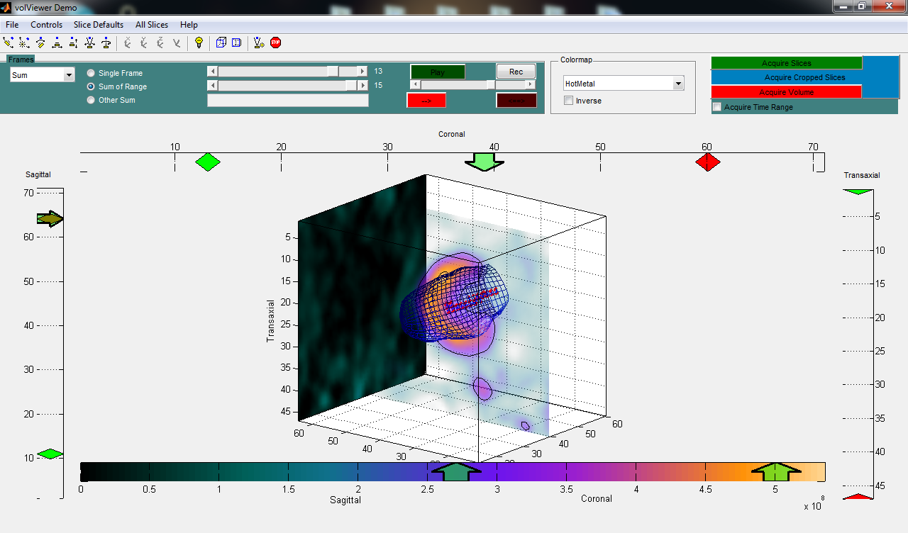
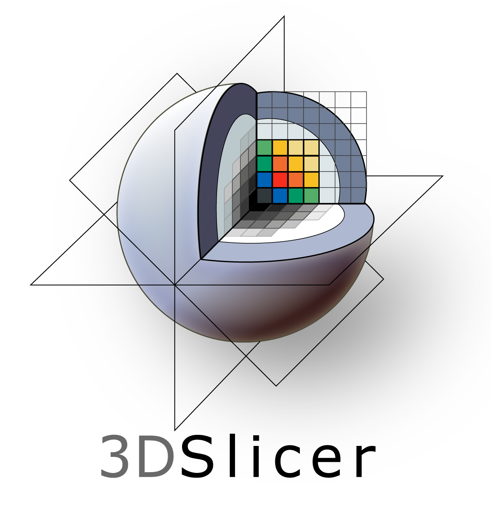
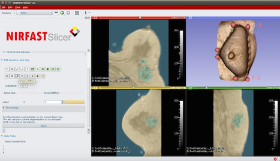

### வணக்கம், நான் ஆறுமுகராஜ் !   Hi there 👋 I am ARUMUGARAJ.M ! 

### About me:
- 🔭 Currently I’m working on Deep learning 
- 🌱 Currently I’m learning everything 🤣
- 👯 I’m looking to collaborate with other repository creators
- 🥅 2022 Goals: Contribute more to Open Source projects
- 🤔 I’m looking for help to learn more about deep learning programs
- 💬 Ask me about ...
- 📫 How to reach me: arumugraj.m@gmail.com
- ⚡ Fun fact about me: Sometimes, I don't know what I'm doing. Sometimes, I don't know what I have to do.

### Connect with me:
[][youtube]
[][facebook]
[][twitter]
[][li]
[][instagram]
[][git]
[][gmeet]

 

### Languages and Tools:

[][matlab]
[][kwave]
[][nirfast]
[][anaconda]
[][MCX]
[][comsol]

 

### 3D Visualization Tools:
[][paraview]
[][tecplot]
[][volumeViewer]
[][3DSlicer]
[][NIRFASTSlicer]

### Education details:
- B.E (in Electrical and Electronics Engg. from Government College of Engineering, Bargur, TamilNadu - 2007-2011)
- M.Tech. (in Process Control and Instrumentation from NIT Trichy, TamilNadu - 2011-2013)

### Work experience:
- Temporary Faculty; Department of Electrical and Electronics Engineering, National Institute of Technology- Tiruchirappalli, Tamil Nadu, India; Aug 2018 – Dec 2019

### Subjects Taught:
#### Instructor for following subjects/ lab of B.Tech./M.Tech.:
- Subjects:Circuit Theory; Electric Power Utilization; Digital Signal Processing; Advanced Digital Signal Processing
- Laboratory handled:Power Systems Lab; DC Machines and transformer Lab; Synchronous and Induction Machines Lab; Integrated Circuits Laboratory;

### Publications:
- Arumugaraj Madasamy, Vipul Gujrati, Vasilis Ntziachristos, and Jaya Prakash,
”Deep learning methods hold promise for light fluence compensation in threedimensional
optoacoustic imaging,” Journal of Biomedical Optics (In Press) 2022.

### Projects:
**Deep learning methods hold promise for light fluence compensation in three-dimensional optoacoustic imaging**
 
• Aim: Deep learning models (U-Net, FD U-Net, Y-Net, FD Y-Net,
Deep Res-U-Net, GAN) were compared and investigated to enable
optical absorption coefficient recovery at a particular wavelength in a
non-homogeneous background medium.
 
• Contribution: We introduced 3D optical fluence compensation using
deep learning model and analyzed the results for 2D.

**Automatic Detection of Coronavirus Disease (COVID-19) Using X-ray Images and Deep CNNs**
 
• Aim: Comparing different algorithms performance for automatically
classifying different lung infections like bacterial pneumonia, viral
pneumonia, COVID-19 or healthy using different pre-trained
convolution neural network models.
 
• Contribution: Evaluated the DL model performance with ResNet50,
ResNet101, ResNet152, InceptionV3 and Inception-V2; based on
transfer learning using ImageNet pretrained models.
 

**Sparse data recovery for k-space MRI data using deep learning method**
 
• Aim: Recover full k-space data by using data driven model.
 
• Contribution: U-Net model was used to reconstruct the MR images
with high quality.
 

**Scattered data interpolation by using deep learning method**
 
• Aim: Find out missing k-space data points by using interpolation
technique in k-space domain.
 
• Contribution: Implement U-Net architecture for MRI reconstruction
and understood different types of interpolation techniques.
 

**FREQUENCY RESPONSE ANALYSIS OF HYBRID PZT CANTILEVER BEAM**
 
• Aim: Frequency response analysis of hybrid aluminium beam with piezoelectric actuators was performed using finite element method. 
 
• Contribution: The finite element model was implemented in MATLAB software.
 

**VIBRATION CONTROL OF BEAM BY USING DAMPING MATERIAL**
 
• Aim: The purpose behind this study is to predict damping effects using method of free layer and constrained layer damping. This study presents a passive vibration control technique applied to a beam structure.
 
• Contribution: Passive vibration control model was implemented in MATLAB software.
 

**VOLTAGE SAG MITTIGATION BY USING ‘DVR’**
 
•Aim: To design a plant setup which is practically find out the voltage sag and also give the protection to consumer device from the voltage sag problem. The Dynamic Voltage Restorer (DVR) is fast, flexible and efficient solution to voltage sag problem.

### Assist Internship Projects:
- Direct PA image reconstruction using CNN
- A light weight DL model for 3D deconvolution
- Estimation of oxygen saturation using deep learning approach
- Optical scattering coefficient recovery from PA image

### Awards and Grands:
- AICTE – GATE scholarship during M.Tech

### Achievements and Extra Curricular Activities:
- GATE: Qualified in 2011, 2013, 2015, 2018, 2019
- Hospitality core team member of ‘20th National Power System Conference (NPSC-2018)’ organized by National Institute of Technology- Tiruchirappalli, Tamil Nadu, India
- Hospitality core team member of ‘09th National Power Electronics Conference (NPEC-2019)’ organized by National Institute of Technology- Tiruchirappalli, Tamil Nadu, India
- A paper on A VEHICLE’S SIXTH SENSE was presented at Kumara guru College of Technology, Coimbatore.
- A paper on POWER QUALITY AND CONTROL was presented in ELECTRICUS’X-2010 at Infant Jesus College of Engineering, Tuticorin.
- Actively participated CIRCUIT DEBUGGING event in ELECTRICUS’X-2010 at Infant Jesus College of Engineering, Tuticorin.
- A paper on SMART SENSOR was presented in HESPEROS’10 at Government College of engineering, Bargur.
- Active member of N.S.S in GCE Bargur and participated in the SEVEN DAY special camping program at EMAKKALNATTHAM.
- Actively participated various games (Volley ball, Chess, 5000m Road Race) in intramural sports meet for the year of 2010-11 conducted by GCE, Bargur.
- Active member of software committee in National Level Technical Symposium PHANTASM'09 conducted by SEEE on 16th & 17th September 2009.
- அரசினர் பொறியியற் கல்லூரி பர்கூரில் நடைபெற்ற கலைச்சாரல்'11 விழாவில் பல்லூடகப் போட்டியில் பங்கு கொண்டுள்ளேன்.
- Delivered a talk at "The International Symposium on Instrumentation (ISI-03) & National Symposium on Instrumentation (NSI-43) 7th - 9th October 2021" in "Electro-Optics" track about "optical fluece compensation using deep learning method".
- Presented an abstract in a workshop titled "The role of AI in transforming healthcare" held from 11-12 June 2022 at Goa, India Jointly organised by Translational Health Science Technology Institute, University of Oxford and Centre for Integrative Biology and Systems medicine, IIT Madras. The title of the abstract was "Deep learning methods hold promise for light fluence compensation in optoacoustic imaging".

### Research Interests:
#### IMAGING PHYSICS
1. Photoacoustic Tomography 
2. Computed Tomography
3. Magnetic Resonance Imaging

#### INVERSE PROBLEMS
1. Image Reconstruction
2. Deep Learning (Post processing)

#### IMAGE ANALYSIS
1. Image Restoration
2. Image Segmentation
3. Image Registration

### Contact Address:
Block A, 
Room number T022, 
C.V.Raman Road, IISc, 
Bengaluru, 
Karnataka (State), 
India (Country), 
Pin-560012. 
Email: arumugaraj.m@gmail.com, arumugarajm@iisc.ac.in  
Phone: +91 - 8838368879  

[youtube]: https://www.youtube.com/channel/UC3DtesIUQKZpZOtFJ5Ftdng
[facebook]: https://www.facebook.com/arumuga.raj.52
[kwave]: http://www.k-wave.org/
[nirfast]: https://milab.host.dartmouth.edu/nirfast/
[matlab]: https://www.mathworks.com/products/matlab.html
[anaconda]: https://www.anaconda.com/products/individual
[MCX]: http://mcx.space/wiki/index.cgi?Learn#mmc
[comsol]: https://www.comsol.co.in/product-download/5.4/windows
[twitter]: https://twitter.com/Arumuga76587827?s=08
[li]: https://www.linkedin.com/in/arumugaraj-m-95b92b38/
[instagram]: https://www.instagram.com/arumuga.raj.52/
[git]: https://github.com/arumugarajm
[gmeet]: https://meet.google.com/tya-vhbz-wcq
[tecplot]: https://www.tecplot.com/
[paraview]: https://www.paraview.org/
[volumeviewer]: https://www.mathworks.com/matlabcentral/fileexchange/45050-volumeviewer
[3DSlicer]: https://www.slicer.org/
[NIRFASTSlicer]: https://milab.host.dartmouth.edu/nirfast/

